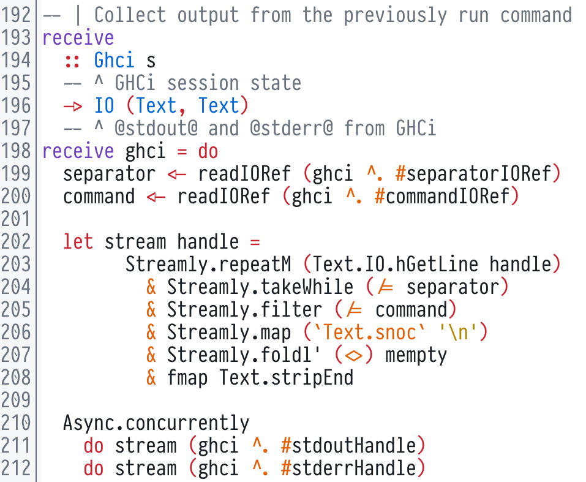

# primer.kak


Color scheme for [Kakoune](https://github.com/mawww/kakoune) based on GitHub's
[Primer design system](https://primer.style/).

## Screenshot

Example of some arbitrary Haskell code:



## Installation

### Using [plug.kak](https://github.com/andreyorst/plug.kak) (recommended)

With plug.kak installed, add to your `kakrc` file:

```kakoune
plug "evanrelf/primer.kak" theme config %{ colorscheme primer }
```

### Manually

Download color scheme:

```bash
$ curl -L https://raw.githubusercontent.com/evanrelf/primer.kak/master/colors/primer.kak -o ~/.config/kak/colors/primer.kak --create-dirs
```

Add to your `kakrc` file:

```kakoune
colorscheme primer
```
